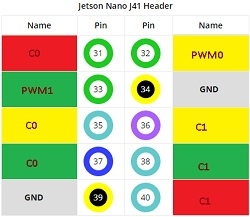

# EdgeAV-Bot

# Initialization

Jetson has 2 PWM pins (pin 32,33).
Need to enable them running the following script once:

```
bash enable_pwm.sh
```

# Robot Movements

Driver choice:
 - 2x L298N Dual H Bridge Motor Controller Board [link](https://www.amazon.ca/gp/product/B0786L5YPP/ref=ppx_yo_dt_b_asin_title_o05_s00?ie=UTF8&psc=1)

Motors:
 - Motor1: Rear axle - brushed DC motor. [PWM controlled - pin 32]
 - Motor2: Front axle - brushed DC motor. [PWM controlled - pin 33]
 - Motor3: Steering - brushed DC motor. [ON/OFF =(L/R)]





